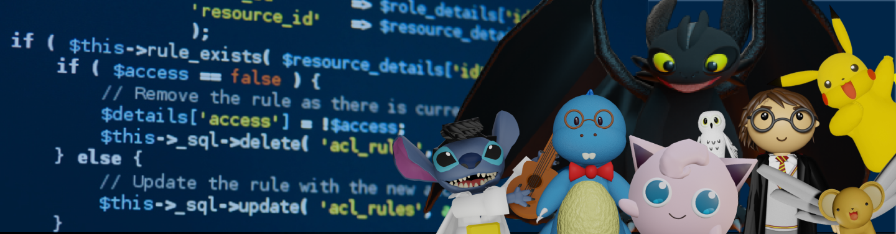

🔹🔹🔹🔹🔹🔹🔹🔹🔹🔹🔹🔹🔹🔹🔹🔹🔹🔹🔹🔹🔹🔹🔹🔹🔹🔹🔹🔹🔹🔹🔹🔹🔹🔹🔹🔹🔹🔹🔹🔹🔹🔹🔹🔹🔹🔹🔹🔹🔹🔹🔹

<table><tr><td style="color:blue" align="justify">
Game and Front End Developer, orientada a la resolución de problemas a través del diseño y construcción de productos digitales únicos, con formación profesional en Administración de empresas de la cual obtuve grandes aprendizajes gracias a la implementación de ideas de negocio desde cero. Visualizo cada comienzo como una nueva oportunidad de crecimiento, me apasionan los videojuegos, el aprendizaje constante, los nuevos retos en el área de tecnología, la programación, el modelado 3D y AR.
</td></tr></table >

🔹🔹🔹🔹🔹🔹🔹🔹🔹🔹🔹🔹🔹🔹🔹🔹🔹🔹🔹🔹🔹🔹🔹🔹🔹🔹🔹🔹🔹🔹🔹🔹🔹🔹🔹🔹🔹🔹🔹🔹🔹🔹🔹🔹🔹🔹🔹🔹🔹🔹🔹
<a href="https://sakaine04.itch.io/">
 Itch.io
</a>

<!--
**Nataliasita/nataliasita** is a ✨ _special_ ✨ repository because its `README.md` (this file) appears on your GitHub profile.

Here are some ideas to get you started:

- 🔭 I’m currently working on ...
- 🌱 I’m currently learning ...
- 👯 I’m looking to collaborate on ...
- 🤔 I’m looking for help with ...
- 💬 Ask me about ...
- 📫 How to reach me: ...
- 😄 Pronouns: ...
- ⚡ Fun fact: ...
-->
