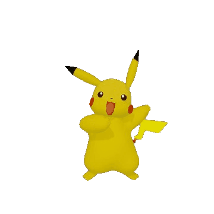

<h2>@Sakaine04</h2>

🔹🔹🔹🔹🔹🔹🔹🔹🔹🔹🔹🔹🔹🔹🔹🔹🔹🔹🔹🔹🔹🔹🔹🔹🔹🔹🔹🔹🔹🔹🔹🔹🔹🔹🔹🔹🔹🔹🔹🔹🔹🔹🔹🔹🔹🔹🔹🔹🔹🔹🔹

<table><tr><td style="color:blue" align="justify">
Especialista en Inteligencia Artificial - Desarrolladora de Software con una conexión al asombroso mundo del diseño UX/UI, orientada a la resolución de problemas a través de la construcción de productos digitales únicos, combinando mi formación técnica con la Administración de empresas a través de la implementanción de ideas de negocio desde cero, aportando un enfoque integral a cada proyecto. 

Apasionada por los videojuegos, el aprendizaje constante, los nuevos retos en el área de tecnología, la inteligencia artificial, la programación, el modelado 3D y la realidad aumentada (AR).
</td></tr></table >

🔹🔹🔹🔹🔹🔹🔹🔹🔹🔹🔹🔹🔹🔹🔹🔹🔹🔹🔹🔹🔹🔹🔹🔹🔹🔹🔹🔹🔹🔹🔹🔹🔹🔹🔹🔹🔹🔹🔹🔹🔹🔹🔹🔹🔹🔹🔹🔹🔹🔹🔹

<table align="left" style="width:300px;"><tr><td style="color:blue" align="center">
  <a href="https://www.linkedin.com/in/natalia-gonzalez-lizarazo/">
    
LinkedIn

  </a>
</td></tr></table >

<table align="left" style="width:300px"><tr><td style="color:blue" align="center">
  <a href="https://sakaine04.itch.io/">
    
    
 Itch.io 

  </a>
</td></tr></table >

<table align="left" style="width:300px" ><tr><td style="color:blue" align="center">
  <a href="https://www.instagram.com/sakaine04/">  
    
Instagram

  </a>
</td></tr></table >

<table align="left" style="width:300px" ><tr><td style="color:blue" align="center">
  <a href="http://sakainecode-art.com/">  
    
Website

  </a>
</td></tr></table >

<!--
**Nataliasita/nataliasita** is a ✨ _special_ ✨ repository because its `README.md` (this file) appears on your GitHub profile.

Here are some ideas to get you started:

- 🔭 I’m currently working on ...
- 🌱 I’m currently learning ...
- 👯 I’m looking to collaborate on ...
- 🤔 I’m looking for help with ...
- 💬 Ask me about ...
- 📫 How to reach me: ...
- 😄 Pronouns: ...
- ⚡ Fun fact: ...
-->
